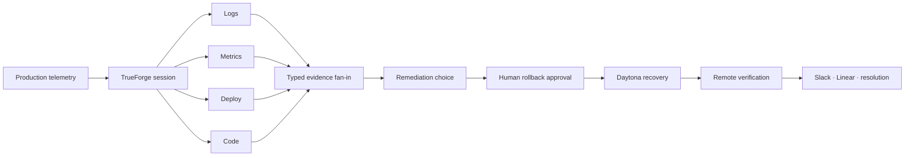

# ONCALL

[](https://github.com/truefoundry/trueforge)
[](https://www.daytona.io/)
[](https://www.typescriptlang.org/)

> A local-first autonomous incident commander built on TrueForge. It turns a production page into a parallel investigation, evidence-correlated root cause, human-gated remediation, isolated Daytona recovery, and durable operational closeout.

## Technical map



| Deep dive | What it proves |
|---|---|
| [System architecture](docs/architecture.md) | Component and data-flow boundaries |
| [TrueForge surface map](docs/trueforge-surfaces.md) | Harness depth across 20 concrete capabilities |
| [Evidence contracts](docs/evidence-contracts.md) | Typed specialists and correlation gates |
| [Safety boundaries](docs/safety-boundaries.md) | Choice, approval, mutation, and recovery separation |
| [Durable remediation](docs/durable-remediation.md) | SQLite state machine and restart reconciliation |
| [Daytona execution](docs/daytona-execution.md) | Credential-isolated recovery pipeline |
| [Operator telemetry](docs/operator-telemetry.md) | Event-derived UI and replay trust rules |
| [Security model](docs/security-model.md) | Credential, input, and external-effect boundaries |
| [Qodo review impact](docs/qodo-impact.md) | Review findings translated into architecture |
| [Verification strategy](docs/verification-strategy.md) | Static, automated, live, and responsive proof |
| [Design decisions](docs/design-decisions.md) | Critical constraints and rejected shortcuts |

## Production incidents are now the code-review bottleneck

Engineering teams can generate code faster than they can safely operate it. During the first minutes of a production incident, a human still has to open PagerDuty, logs, metrics, deploy history, source code, Slack, and the runbook before they can explain what broke.

**ONCALL owns that first response without taking control away from the operator.**

When checkout degrades, ONCALL acknowledges the page, launches four isolated investigators in parallel, correlates their typed evidence, renders the root cause, synchronizes the operator checkpoint across the control room and Slack, pauses before every production write, executes an approved rollback in Daytona, verifies recovery, and closes the loop with the systems responders already use.

## The pitch

A production alert fires. Before the responder finishes opening their laptop, four TrueForge subagents are already reading error logs, service metrics, recent deploys, and changed source code in parallel. They converge on one evidence-linked diagnosis: a deploy introduced serial database writes in the checkout request path, driving p99 latency above six seconds and producing deadline failures. ONCALL recommends rollback—but cannot act until a human chooses the path and approves the exact mutation. Approval resumes the same durable TrueForge session. Daytona reproduces the regression, creates and tests the revert, pushes it, verifies the remote SHA, and stops the sandbox. ONCALL then publishes the result to Slack, records follow-up work, resolves the incident, and preserves the entire operational history for replay.

## Architecture

```text
┌─────────────────────────────────────────────────────────────────────────────────────────────┐
│                                   PRODUCTION CONTROL ROOM                                  │
│                                                                                             │
│  ┌───────────────────────────────┐       terminal trigger       ┌────────────────────────┐  │
│  │ LIVE PRODUCTION MONITOR       │ ───────────────────────────▶ │ LOCAL DEMO CONTROL     │  │
│  │ checkout-svc                  │                              │ state + Slack bridge   │  │
│  │ traffic · p99 · errors · logs │ ◀──── incident / recovery ── │ signed checkpoint URLs │  │
│  └───────────────────────────────┘                              └───────────┬────────────┘  │
│                                                                            │               │
│                              creates session + turn                         │               │
│                                                                            ▼               │
│  ┌───────────────────────────────────────────────────────────────────────────────────────┐  │
│  │                              TRUEFORGE AGENT HARNESS                                  │  │
│  │                                                                                       │  │
│  │  Saved agent · persistent SQLite sessions · SSE events · OpenAI GPT-5.6-sol          │  │
│  │  Git-backed runbook skill · dynamic subagents · ask-user · approval gates · OpenUI   │  │
│  │  sandbox-as-tool · Code Mode · large-response offload · SDK automation               │  │
│  │                                                                                       │  │
│  │       ┌────────────────┐  ┌────────────────┐  ┌────────────────┐  ┌──────────────┐    │  │
│  │       │ LOG ANALYZER   │  │ METRICS        │  │ DEPLOY         │  │ CODE BLAME   │    │  │
│  │       │ first failure  │  │ baseline/peak  │  │ suspect commit │  │ exact lines  │    │  │
│  │       └───────┬────────┘  └───────┬────────┘  └───────┬────────┘  └──────┬───────┘    │  │
│  │               └───────────────────┴──────────┬─────────┴──────────────────┘            │  │
│  │                                              ▼                                         │  │
│  │                                TYPED EVIDENCE FAN-IN                                   │  │
│  │                     temporal match · deploy agreement · symptom fit                    │  │
│  │                                              │                                         │  │
│  │                                              ▼                                         │  │
│  │                              RCA → CHOICE → APPROVAL GATE                              │  │
│  └──────────────────────────────────────────────┬────────────────────────────────────────┘  │
│                                                 │                                           │
│                         approved destructive MCP call                                       │
│                                                 ▼                                           │
│  ┌──────────────────────────────┐      ┌──────────────────────┐      ┌────────────────────┐ │
│  │ CHECKOUT-SVC-SIM MCP         │ ───▶ │ DAYTONA SANDBOX      │ ───▶ │ GITHUB             │ │
│  │ incident · logs · metrics    │      │ clone · reproduce    │      │ push revert        │ │
│  │ deploy · code · audit        │      │ revert · test · push │      │ verify remote SHA  │ │
│  │ Slack · rollback · resolve   │      │ verify · stop        │      │ permanent-fix PR   │ │
│  └──────────────────────────────┘      └──────────────────────┘      └────────────────────┘ │
│                                                 │                                           │
│                                                 ▼                                           │
│  ┌──────────────────────────────┐      ┌──────────────────────┐      ┌────────────────────┐ │
│  │ SLACK #oncall-demo           │      │ LINEAR               │      │ PAGERDUTY SIM      │ │
│  │ investigation · checkpoints │      │ tested follow-up     │      │ acknowledge/resolve│ │
│  │ final RCA + recovery links   │      │ permanent guard     │      │ durable audit      │ │
│  └──────────────────────────────┘      └──────────────────────┘      └────────────────────┘ │
└─────────────────────────────────────────────────────────────────────────────────────────────┘
```

## What the demo shows

### 1. Production telemetry is already moving

The demo opens on a dedicated production monitor. Checkout traffic, p99 latency, error rate, topology, and a live ingestion stream move continuously. ONCALL is armed but not yet running.

### 2. One terminal command fires the page

```bash
./demo/trigger-alert.sh INC-4821
```

The production monitor crosses its thresholds, displays the incident, and holds the red detection state long enough to read. At the same time:

- a durable TrueForge session is created;
- the runbook turn begins;
- `#oncall-demo` receives **ONCALL is investigating**;
- the browser enters the live incident session.

### 3. Four investigators work concurrently

The incident route is not a chat transcript. It is an event-derived command board with four independent worker streams:

| Specialist | Owns | Required evidence |
|---|---|---|
| `log-analyzer` | Error logs | first failure, grouped signature, verbatim samples |
| `metrics-analyzer` | Service telemetry | baseline, first anomaly, peak p50/p95/p99/error rate |
| `deploy-investigator` | Release history | suspect deploy, SHA, timestamp, author, changed files |
| `code-blame` | Source attribution | independent deploy selection, exact file and line range, symptom fit |

Each worker receives an isolated context and returns a strict JSON contract. The primary agent cannot declare a root cause until all four reports are complete and the correlation gates pass.

### 4. The operator remains in control

ONCALL renders the correlated remediation choices. The same checkpoint is posted to Slack. A response from either surface resumes the same TrueForge session.

Selection is not approval. Before any write, TrueForge pauses again and shows:

- the exact operation;
- why it is requested;
- the target repository and branch;
- the expected side effect;
- **Allow** and **Deny**.

The first recorded decision wins. Reconnects never repeat a completed mutation.

### 5. Daytona performs the approved recovery

The rollback is one approval-gated MCP operation backed by a real Daytona sandbox:

```text
allocate → clone → reproduce → prepare deterministic revert
         → run tests → verify healthy post-state
         → push → verify remote SHA → stop sandbox
```

Mutation credentials are unavailable during preparation. They are injected only for the approved push phase. The durable coordinator checkpoints the expected revert SHA before mutation and reconciles remote state after restart.

### 6. Recovery is proved, not narrated

ONCALL accepts rollback success only when the structured response proves every invariant:

- the approved incident, deploy, repository, and branch match;
- the pre-state reproduces the degraded request profile;
- tests pass;
- post-state has zero request errors and healthy p99;
- revert SHA equals remote SHA;
- sandbox is stopped;
- the durable audit records the executed operation.

The final scene separates two outcomes:

1. **Production recovered** — the tested rollback is live on `main`.
2. **Permanent guard under review** — a separate tested fix remains an open PR, not silently deployed.

## TrueForge depth

ONCALL uses the harness as the execution system—not as a model wrapper.

| TrueForge capability | How ONCALL uses it |
|---|---|
| Custom MCP | Twelve incident, evidence, rollback, audit, and provider tools over Streamable HTTP |
| Multiple connectors | Custom incident MCP, official GitHub MCP, official Linear MCP |
| Dynamic subagents | Four sibling investigators launched together with isolated contexts |
| Typed subagent contracts | Invalid prose, missing evidence, and incomplete unknowns block correlation |
| Persistent sessions | Session, turns, checkpoints, and events survive browser and process reconnects |
| SSE streaming and replay | Live event ingestion plus deterministic replay into the command board |
| Ask-user | Remediation selection is a real paused TrueForge required action |
| Tool approval gates | Rollback, Slack, Linear, and resolution require explicit approval |
| Generative UI | Correlated RCA and remediation evidence render through native OpenUI |
| Sandbox-as-tool | Independent sandbox execution remains visible in the durable session |
| Daytona | Approved rollback runs in an ephemeral remote sandbox |
| Git-backed skill | The on-call runbook is mounted from an immutable repository revision |
| Code Mode | Diagnostics can orchestrate awaited MCP calls inside the harness |
| Large-response offload | Oversized evidence is persisted outside the model context and retrieved intentionally |
| Saved reusable agent | `oncall-incident-responder` is registered once and reused by UI, SDK, and terminal trigger |
| SDK automation | The trigger and replay pipeline create and drive real sessions programmatically |
| Embedded UI | The native TrueForge workbench exists as a separate operator route, not the product surface |

## Safety model

```text
READS                         HUMAN CHECKPOINTS                     WRITES
incident/logs/metrics  ──▶  remediation selection  ──▶  exact tool approval
source/deploy history       (not an execution grant)       │
                                                           ▼
                                                isolated preparation
                                                           │
                                                durable pre-push checkpoint
                                                           │
                                                           ▼
                                                  push + remote verify
```

Key constraints:

- No destructive action runs without native TrueForge approval.
- Slack delivery is approval-gated separately from rollback.
- A rollback in progress blocks incident resolution.
- SQLite transactions reserve one active remediation and prevent concurrent mutation.
- A restart compares remote HEAD with the approved deploy and persisted revert; any unrelated SHA becomes a conflict.
- Errors remain visible; the system does not turn missing evidence into success.

## Repository structure

```text
agent/                         saved-agent definition and typed contracts
apps/operator/                 production monitor, incident command UI, Slack action bridge
mcp-servers/checkout-svc-sim/  Streamable HTTP MCP, durable coordinator, Daytona executor
skills/oncall-runbook/          immutable evidence-first response procedure
demo/                          terminal ignition command
demo-svc/                      reproducible checkout regression target
scripts/                       bootstrap, SDK session driver, verification utilities
tests/                         unit, integration, transport, durability, and UI contracts
evidence/                      machine-readable live execution proofs
```

## Run the demo

Prerequisites:

- TrueForge on `127.0.0.1:8790`;
- checkout incident MCP on `127.0.0.1:8941`;
- operator on `127.0.0.1:4334`;
- credentials loaded from the local `.env`.

Start on the production monitor:

```text
http://127.0.0.1:4334/
```

Then fire the incident:

```bash
./demo/trigger-alert.sh INC-4821
```

Keep three panes visible during the recording:

1. production monitor / ONCALL command;
2. Slack `#oncall-demo`;
3. terminal for the single ignition command.

## Why this matters

The difficult part of an incident agent is not generating an RCA paragraph. It is building a system that can gather evidence concurrently, prove its causal chain, stop at the correct boundary, execute one approved change, recover safely after interruption, and leave behind a durable operational record.

ONCALL demonstrates that an agent harness can own real incident work while the human retains final authority.
