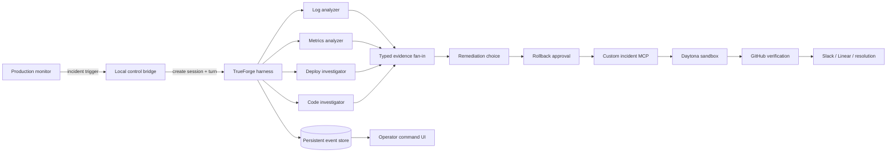

# System Architecture

ONCALL is organized as a control plane around one durable TrueForge session. The browser is a projection of authoritative events; it is not the execution engine.

## Boundaries

- **TrueForge** owns agent planning, tools, subagents, required actions, approvals, persistence, and replay.
- **checkout-svc-sim MCP** owns incident evidence, domain state, the durable rollback coordinator, and provider actions.
- **Daytona** owns isolated reproduction, revert preparation, tests, and the approved Git operation.
- **Operator UI** turns session events into legible operational scenes without parsing assistant prose as truth.
- **Slack and Linear** are external operating surfaces, not mocked UI decorations.

## Data flow

1. A terminal trigger creates a named TrueForge session and starts the incident turn.
2. The agent acknowledges the incident and creates four sibling subagents in one response.
3. Each specialist calls only the tools needed for its evidence boundary.
4. Typed reports converge through explicit correlation gates.
5. The remediation choice creates no production side effect.
6. `rollback_execute` is the sole approval-gated production mutation.
7. The MCP checkpoints prepared evidence before any push.
8. The remote SHA and post-state determine whether recovery is complete.
9. Persisted events rebuild the command UI after a refresh or process restart.
