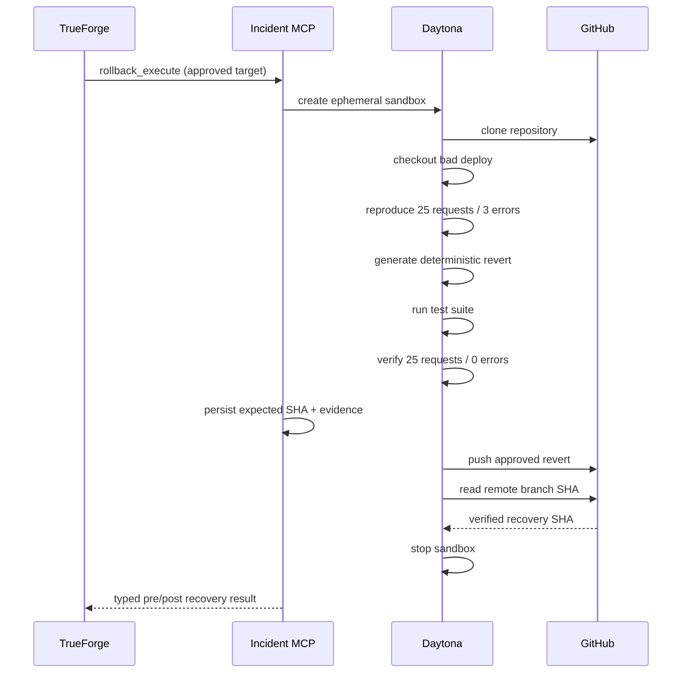

# Daytona Execution

Daytona provides the isolated environment for the approved recovery.

## Credential boundary

Preparation receives no push token. The GitHub credential is supplied only to the apply phase after approval and durable checkpointing.

## Deterministic identity

The revert uses a fixed commit date and explicit author identity so retries generate the same SHA. This lets the coordinator prove whether a prior mutation already landed.

## Typed success result

The MCP returns the sandbox ID, exact pre/post metrics, test status, revert SHA, remote SHA, cleanup status, and audit event. The operator UI derives recovery from these fields rather than from model prose.
