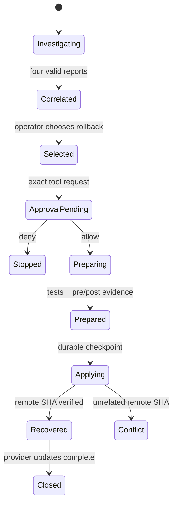

# Safety Boundaries

ONCALL separates investigation, selection, approval, preparation, mutation, and closeout.

## Invariants

- Remediation choice is not execution permission.
- Only `rollback_execute` crosses the production mutation boundary.
- The approval payload fixes the incident, deploy, repository, branch, actor, and reason.
- Preparation does not receive push credentials.
- Expected revert SHA and evidence are durable before push.
- A competing rollback cannot reserve the same incident.
- Incident resolution is blocked while remediation is active.
- A denied approval ends remediation immediately.
- Failed tests, mismatched SHAs, missing evidence, or sandbox cleanup failure remain visible.

## Recovery boundary

Recovery requires all of the following:

- degraded pre-state reproduced;
- tests passed;
- healthy post-state verified;
- revert SHA equals remote SHA;
- sandbox stopped;
- durable audit event written.

Assistant narration cannot satisfy any of these invariants.
